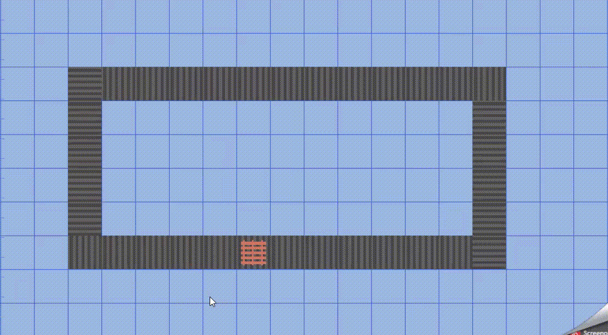

# Faketory

## About Faketory
Web application, which allows user to create simple automation systems by using pre-created elements. Elements can be then controlled by a real PLC controller, or it simulator.
It was created mainly for PLC programming learning purposes, but it also can be used as a tool to design simple production lines, or to visualize some processes.

##  Launching requirements:
- .NET 6.0
- Node.js

## Supported PLC
Currently applcation supports **only Siemens S7 family drivers**,  including Siemens PLCSim.
